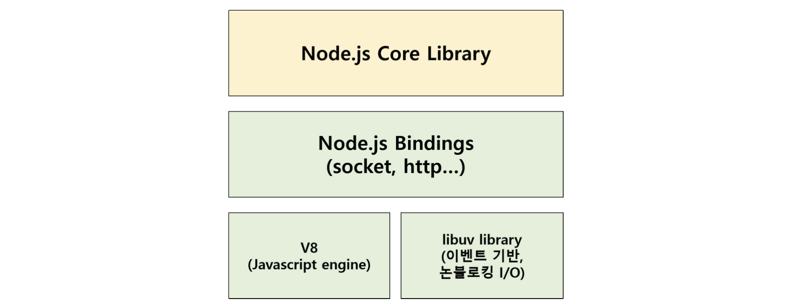
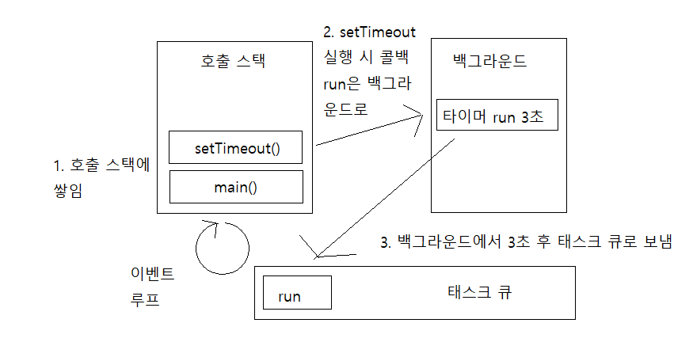
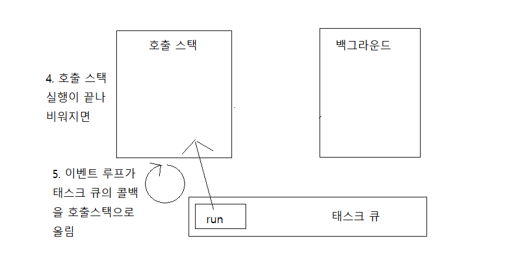
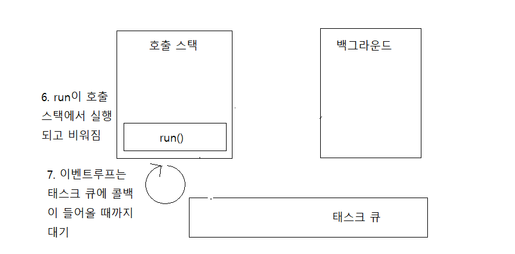
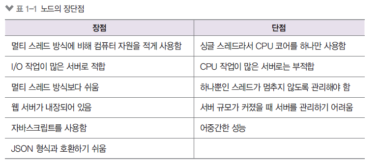

# 01. 노드 시작하기

---

## 1.1 핵심 개념 이해하기

- 노드의 공식사이트(<https://nodejs.org/ko/>) 에서는 노드를 아래와 같이 설명하고 있다.

> Node js는 크롬 V8 자바스크립트 엔진으로 빌드된 자바스크립트 런타임입니다. Node.Js는 이벤트 기반, 논블로킹 I/O 모델을 사용해 가볍고 효율적입니다. Node.js의 패키지 생태계인 npm은 세계에서 가장 큰 오픈소스 라이브러리입니다 생태계입니다.

### 1.1.1 서버

노드는 다양한 자바스크립트 애플리케이션을 실행할 수 있지만 서버 애플리케이션을 실행하는데 제일 많이 사용된다.
서버란 클라이언트의 요청에 의해 저장된 데이터를 응답해주는 곳, 서버가 클라이언트 역할도 할 수 있다. 노드는 자바스크립트 애플리케이션이 서버로서 기능하기 위한 도구를 제공하므로 서버 역할을 수행할 수 있다. 다른 언어를 사용하지 않고 노드를 사용해 서버를 만드는 이유는 아래와 노드의 특성 때문이다.

### 1.1.2 자바스크립트 런타임

- 노드는 자바스크립트 런타임이다.

런타임은 특정 언어로 만든 프로그램들을 실행할 수 있는 환경을 뜻한다. -> 노드는 자바스크립트 프로그램을 컴퓨터에서 실행할 수 있게 해준다.<br />
기존에는 자바스크립트 프로그램을 인터넷 브라우저(브라우저도 자바스크립트 런타임이다) 위에서만 실행할 수 있었고 이후 구글이 V8 엔진을 사용하여 크롬을 출시했는데 이 V8엔진이 오픈소스로 공개 되어 라이언 달이라는 사람이 V8 엔진 기반의 노드 프로젝트를 시작함.
</img>

- 노드는 V8과 더불어 libuv 라는 라이브러리를 사용한다
  libuv 라이버리르는 노드의 특성인 이벤트 기반, 논블로킹 I/O 모델을 구현하고 있으며 노드는 스스로 이벤트 기반, 논 블로킹 I/O모델을 사용해 가볍고 효율적이라고 표현했다.

### 1.1.3 이벤트 기반

이벤트 기반이란 이벤트가 발생할 때 미리 지정해둔 작업을 수행하는 방식을 의미한다. 이벤트로는 클릭이나 네트워크 요청 등이 있을 수 있다. <br />
이벤트 기반 시스템에서는 특정 이벤트가 발생할 때 무엇을 할지 미리 등록해주어야 하는데 이것을 이벤트 리스너에 콜백 함수를 등록한다고 표현한다. <br />
예를들어) 클릭 이벤트 리스너에 경고창을 띄우는 콜백 함수를 등록해두면 클릭 이벤트가 발생할 때마다 콜백 함수가 실행돼 경고 창이 뜬다.

- 노드도 이벤트 기반 방식으로 동작하므로 이벤트가 발생하면 이벤트 리스너에 등록해둔 콜백 함수를 호출한다.
  <br></br>

이벤트 기반 모델에서는 이벤트 루프라는 개념이 등장한다 여러 이벤트가 동시에 발생했을 때 어떤 순서로 콜백 함수를 호출할지 이벤트 루프가 판단한다.

```javascript
function first() {
  second();
  console.log("첫번째");
}
function second() {
  third();
  console.log("두번째");
}
function third() {
  console.log("세번째");
}

first();
```

함수의 호출 순서는 first가 먼저 호출되고 그 안의 second가 두번째 마지막으로 third가 호출된다. 하지만 호출된 순서와 반대로 실행이 완료된다.

```
세번째
두번째
첫번째
```

이번에는 특정 밀리초 이후에 코드를 실행하는 setTimeout을 사용하면

```javascript
function run() {
  console.log("3초 후 실행");
}
console.log("시작");
setTimeout(run, 3000);
console.og("끝");
```

결과는

```
시작
끝
3초후 실행
```

위 함수의 내부 과정은 아래 사진과 같다

</img>

- 이벤트 루프 : 이벤트 발생 시 호출할 콜백 함수들을 관리하고, 호출된 콜백 함수의 실행 순서를 결정하는 역할 담당, 노드가 종료될 때까지 이벤트 처리를 위한 작업을 반복하므로 루프라고 불린다
- 태스크 큐 : 이벤트 발생 후 호출되어야 할 콜백 함수들이 기다리는 공간, 콜백들이 이벤트 루프가 정한 순서대로 줄을 서 있으므로 콜백 큐라고도 불린다.
- 백그라운드 : 타이머나 I/O 작업 콜백 또는 이벤트 리스너들이 대기하는 곳

먼저 main 함수가 호출되고 그 뒤에 setTimeout이 호출 스택에 들어간다. 스택에 쌓인 순서와 반대로 setTimeout이 먼저 실행되는데 setTimeout에서는 타이머와 함께 run 콜백을 백그라운드로 보내고 호출 스택에서 빠진다.
그 다음으로 main 함수가 호출 스택에서 빠진다. 이후 백그라운드에서 3초를 센 후 run 함수를 태스크 큐로 보낸다.

</img>

이벤트 루프는 호출 스택이 비어 있으면 태스크 큐에서 함수를 하나씩 가져와 호출 스택에 넣고 실행한다.

</img>

이벤트 루프가 run 콜백을 태스크 큐에서 꺼내 호출 스택으로 올린 상황. 호출 스택에서 run은 실행되고 실행 완료 후 비워진다. 이벤트 루프는 태스크 큐에서 콜백 함수가 들어올때까지 계속 대기하게 된다.<br/>
만약 호출 함수들이 너무 많이 차 있으면 3초가 지난 후에도 run함수가 실행되지 않을 수 있다. **이벤트 루프는 호출 스택이 비어 있을때만 태스크 큐에 있는 run함수를 호출 스택으로 가져오기 때문이다**
이것이 setTimeout의 시간이 정확하지 않을 수 있는 이유이다.

# 1.1.4 논블로킹 I/O

- 논블로킹 : 이전 작업이 완료될 때까지 멈추지 않고 다음 작업을 수행함을 뜻한다

오래 걸리는 함수를 백그라운드로 보내서 다음 코드가 먼저 실행되게 하고 그 함수가 다시 태스크 큐를 거쳐 호출 스택으로 올라오기를 기다리는 방식

</img>

I/O는 입,출력을 의미하는데 파일 시스템 접근이나 네트워크 요청 같은 작업이 I/O의 일종이다. 이러한 작업을 할때 노드는 논블로킹 방식으로 동작한다

```javascript
function longRunningTask() {
  //오래 걸리는 작업
  console.log("작업 끝");
}
console.log("시작");
setTimeout(longRunningTask, 0);
console.log("다음 작업");
```

```
시작
다음작업
작업끝
```

- setTimeout(콜백,0) 은 코드를 논블로킹으로 만들기 위해 사용하는 기법 중 하나이다. 노드에서는 setTimeout(콜백,0)대신 다른 방식을 주로 사용한다.
  > - **setTimeout(콜백,0)**
  >
  > 밀리초를 0으로 설정했지만 브라우저와 노드에서는 기본적인 지연 시간이 있으므로 바로 실행되지 않는다. HTML5 브라우저에서는 4ms, 노드에서는 1ms 의 지연 시간이 있다.

# 1.1.5 싱글 스레드

노드는 싱글 스레드이다. 자바스크립트와 노드에서 논블로킹이 중요한 이유는 싱글 스레드이기 때문이다.

- 싱글 스레드 + 블로킹 모델

싱글 스레드일때 블로킹 모델이라면 한 작업이 끝날때 까지 나머지 작업을 실행할 수 없으니깐 매우 비효율적이다

- 싱글 스레드 + 논블로킹 모델

노드가 채택하고 있는 방식 싱글 스레드가 여러 작업들을 한번에 받아서 시간이 오래 걸리지만 혼자서 많은 일을 처리할 수 있다.

- 멀티 스레드 + 블로킹 모델

작업 하나당 스레드가 처리를 한다. 속도 면에서는 빠를 순 있지만 놀고 있는 스레드가 발생할 수 있고 스레드마다의 비용이 증가한다.

- 멀티 스레드 + 논블로킹 모델

가장 효율적일 수 있는 방식 ,노드에서는 싱글 스레드를 여러 개를 사용해 멀티 스레딩과 비슷한 기능을 하게 할 수 있다. 엄밀히 말하면 멀티 스레딩이 아닌 멀티 프로세싱 방식이다.

- 프로세스: 운영체제에서 할당하는 작업의 단위, 노드나 인터넷 브라우저 같은 프로개름은 개별적인 프로세스이다. 프로세스 간에는 메모리 등의 자원을 공유하지 않는다.
- 스레드 : 프로세스 내에서 실행되는 흐름의 단위, 하나의 프로세스는 스레드를 여러개 가질 수 있고 스레드들은 부모 프로세스의 자원을 공유한다. (같은 메모리에 접근이 가능하다)

</img>

## 1.2 서버로서의 노드

1.2에서는 노드를 서버로 사용할 때의 특징과 장 단점에 대해 알아본다

</img>
- 장점

1. 멀티 스레드 방식보다 쉽기 때문에 서버 프로그래밍에 익숙하지 않아도 쉽게 입문이 가능
2. 웹 서버가 내장되어있어서 입문자가 쉽게 접근이 가능
3. 자바스크립트를 사용해 웹 사이트 개발시 생상성 증가

- 단점

1. 싱글 스레드이기때문에 CPU 부하가 큰 작업이 적절하지 않다
2. 하나뿐인 스레드가 에러로 인해 멈추지 않게 잘 관리해야 한다

이미지나 비디오 처리, 대규모 데이터 처리 같이 CPU를 많이 사용하는 작업을 위한 서버로는 권장하지 않는다 <br/>
실생활과 밀접한 쇼핑몰, 블로그 같은 웹사이트 에서는 기본적인 틀이 있고 그 안의 내용물(텍스트, 이미지)만 조금씩 바뀌는곳에서는 노드가 다른 서버 언어에 비해 콘텐츠를 제공하는데 뚜렷한 장점이 있지 않지만 적합하지 않다는건 아니다. pug나 EJS 같은 템플릿 엔진을 통해서 다른 언어와 비슷하게 콘텐츠를 제공할 수 있다.

## 1.3 서버 외의 노드

노드는 자바스크립트 런타임이기 때문에 용도가 서버에만 한정된 것은 아니다. 사용 범위가 늘어나 웹 , 모바일, 데스크톱 애플리케이션 개발에도 사용되기 시작했다.
Angular, React, Vue, Meteor, React Native Electro 등등..

## 1.4 개발 환경 설정하기

- 맥 기준으로 적었습니다

노드의 공식 사이트(https://nodejs.org) 에 접속해서 설치.
터미널에서 
```
node -v
v12.9.0

npm -v
6.14.8
```
저는 node 12.9.0 버전과  npm 6.14.8 버전을 사용합니다(21년 3월)

- npm 버전 업데이트하기

```
npm install -g npm
```

- **VS Code 설치하기**

VS Code의 공식 사이트(https://code.visualstudio.com/)에 접속해서  설치한다
