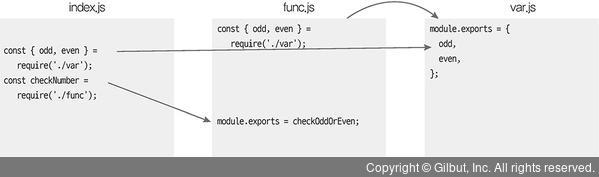

# 3 노드기능 사용하기

노드로 자바스크립트 파일을 실행하는 방법과 노드가 기본적으로 제공하는 객체와 모듈 사용법에 대해 알아본다. 모듈을 사용하면서 중요한 개념인 버퍼와 스트림, 동기와 비동기, 이벤트, 예외 처리에 대해서 배운다

## 3.1 REPL 사용하기

자바스크립트는 스크립트 언어이므로 미리 컴파일을 하지 않아도 즉석에서 코드를 실행시킬 수 있다. 브라우저 콘솔 탭에서 Js 코드를 입력하는 것 처럼 노드도 비슷한 콘솔을 제공하는데

읽고(Read), 해석하고(Eval), 결과물을 반환하고(Print), 종료할 때 까지 반복(Loop) 한다고 해서 REPL(Read Eval Pring Loop)라 부른다.

<br />

터미널에서 node를 입력하면 실행 시킬 수 있다.

```
$ node
>
```

프롬프트가 > 모양으로 바뀌면 Js코드를 입력할 수 있다.

```
> const hello = 'Hello world ~ ';
undefined
> console.log(hello);
Hello wrold ~
undefined
```

REPL을 종료하려면 Ctrl+ C를 두번 누르거나 REPL 창에 .exit를 입력하면 된다.

## 3.2 Js 파일 실행하기

REPL에 직접 코드를 입력하는 대신 Js파일을 만들어서 실행해보자

- helloWorld.js

```javascript
function helloWorld() {
  console.log("Hello World!");
  helloNode();
}
function helloNode() {
  console.log("Hello Node");
}
helloWorld();
```

```
$ node helloWorld
Hello World!
Hello Node
```

콘솔에서 **node [자바스크립트 파일 경로]** 로 실행하고 확장자(.js)는 생략해도 된다.

## 3.3 모듈로 만들기

노드는 코드를 모듈로 만들 수 있는데 모듈이랑 특정한 기능을 하는 함수나 변수들의 집합이다. 모듈로 만들어 두면 여러 프로그램에서 해당 모듈을 재사용할 수 있다. 보통 파일 하나가 모듈이 된다.

var.js, func.js, index.js를 만들어 보자

- var.js

```javascript
const odd = "홀수 입니다";
const even = "짝수 입니다";
module.exports = {
  odd,
  even,
};
```

modele.exports 에 변수들을 담은 객체를 대입함.

- func.js

```javascript
const { odd, even } = require("./var");

function checkOddOrEven(num) {
  if (num % 2) {
    return odd;
  } else {
    return even;
  }
}
module.exports = checkOddOrEven;
```

require 함수안에 불러올 모듈의 경로를 적어 준다. module.exports에 객체 뿐 아니라 함수를 넣어줘도 된다.

- index.js

```javascript
const { odd, even } = require("./var");
const checkNumber = require("./func");

function checkStringOddOrEven(str) {
  if (str.length % 2) {
    return odd;
  }
  return even;
}
console.log(checkNumber(10));
console.log(checkStringOddOrEven("hello"));
```

</img>

ES2015부터는 import from, export default 문법으로 변경됨.
위에서 썼던 require 함수나 module 객체는 따로 선언하지 않았지만 노드에서 제공하는 내장 객체이기 때문에 사용 가능하다.
