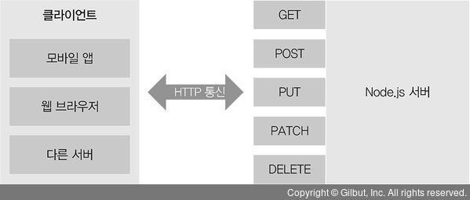

# 4 http 모듈로 웹 서버 만들기

## 4.1 요청과 응답 이해하기

서버는 클라이언트가 있기에 동작한다. 클라이언트에서 서버로 요청(request)을 보내고 서버에서는 요청을 읽고 처리한 뒤 클라이언트에게 응답(response)을 보낸다.

- 서버에서는 요청받는 부분과 응답을 보내는 부분이 있어야 한다. 요청이 들어왔을때 어떤 작업을 수행할지 이벤트 리스너를 미리 등록해놔야 한다

- createServer.js

```javascript
const http = require("http");

http.createServer((req, res) => {
  //응답할지 적는다
});
```

http 서버가 있어야 웹 브라우저 요청을 처리할 수 있으므로 http 모듈을 사용 , `createServer` 라는 메서드가 있다.

- server1.js

```javascript
const http = require('http');

http.createServer((req,res) => {
	res.write('<h1> Hello Node! </h1>');
	res.end('<p> Hello Server! </p>');
}).listen(8080, ()=> {
	console.log('8080번 포트에서 서버 대기중입니다');
})

/*
const server = http.createServer((req,res) => {
	res.write('<h1> Hello Node! </h1>');
	res.end('<p> Hello Server! </p>');
})
server.listn(8080);
server.on('listening', ()=> {
	console.log('8080번 포트에서 서버 대기 중입니다');
});
*/ 이렇게 이벤트 리스너로도 등록 가능하다.
```

- res객체에서 `.write`랑 `end` 메서드가 있다. `.write`의 첫 번째 인자는 클라이언트로 보낼 데이터이다 `.end` 는 응답을 종료하는 메서드이다. 인자가 있다면 그 데이터도 클라이언트로 보내고 응답을 종료한다.

```
node server1
```

http://localhost:8080 또는 http://127.0.0.1:8080 에 접속하면 확인가능
 </img>

- **localhost** 현재 컴퓨터의 내부 주소를 가리킨다. 외부에서 접근할 수 없고 자신의 컴퓨터에서만 접근 가능하며 127.0.0.1도 동일하다
- **포트** 서버 내에서 프로세스를 구분하는 번호. 서버는 HTTP 요청 외에도 다양한 작버을 해야하는데 서버는 프로세스에 포트를 다르게 할당하여 들어오는 요청을 구분한다. 유명한 포트 번호로는 21(FTP), 80(HTTP), 443(HTTPS) 3306(MYSQL) 이 있다.
- http://gilbut.co.kr 같은 사이트는 포트 번호를 따료 표시하지 않는데 80번 포트를 사용하기 때문이다. 80번 포트는 주소에서 포트를 생략할 수 있다.
- 예제에서 80번 포트를 사용하지 않는 이유는 충돌 방지를 위해서이다 . 이미 80번 포트를 다른 서비스가 사용할 확률이 높기 때문이며 충돌이 나면 에러가 발생한다. 실제 배포할때는 80 or 443을 사용한다.

  > - 포트충돌
  >   다른 서비스가 사용하고 있는 포트를 사용할 경우 Error: listen EADDRINUSE ::: 포트번호 같은 에러가 발생한다. 이 경우 그 서비스를 종료하거나 node의 포트번호를 바꿔야 한다.

- server2.html

```html
<!DOCTYPE html>
<html lang="en">
  <head>
    <meta charset="UTF-8" />
    <meta name="viewport" content="width=device-width, initial-scale=1.0" />
    <title>노드 웹 서버</title>
  </head>
  <body>
    <h1>Node js 웹 서버</h1>
    <p>웹 서버 만들 준비 됐?</p>
  </body>
</html>
```

- server2.js

```javascript
const http = require("http");
const fs = require("fs").promises;

http
  .createServer(async (req, res) => {
    try {
      const data = await fs.readFile("./server2.html");
      res.writeHead(200, { "Content-Type": "text/html;charset=utf-8" });
      res.end(data);
    } catch (err) {
      console.error(err);
      res.writeHead(500, { "Content-Type": "text/plain; charset=utf-8" });
      res.end(err.message);
    }
  })
  .listen(8081, () => {
    console.log("8081 포트에서 서버 대기중");
  });
```

요청이 들어오면 fs 모듈로 html 파일을 읽어 보여준다. data 변수에 저장된 버퍼를 그대로 클라이언트에 보내주면 된다.

- res.writeHead는 헤더의 데이터를 넣어줄 수 있음
- 에러 메시지는 일반 문자열이므로 text/plain을 사용
- 책은 1판이고 2판 기준 async, await로 fs로 파일을 읽는 과정을 비동기로 처리함

- HTTP 상태 코드
  > 200이나 500은 HTTP 상태 코드이다. .writeHead에 첫 번째 인자로 상태 코드를 넣었는데 브라우저는 서버에서 보내주는 상태 코드를 보고 요청이 성공했는지 실패했는지 판단한다. 아래는 대표적인 상태코드이다
  > 2XX : 성공을 알리는 코드 . 대표적으로 200(성공) , 201(작성됨)이 많이 사용
  > 3XX : 리다이렉션(다른 페이지로 이동) 을 알리는 상태 코드, 어떤 주소를 입력했는데 다른 주소의 페이지로 넘어갈때 사용, 301(영구이동), 302(임시이동) , 304(수정되지않음)은 요청의 응답으로 캐시를 사용했다는 뜻
  > 4XX : 요청 오류를 나타냄. 요청 자체에 오류가 있을 때 표시되며 대표적으로 400(잘못된 요청), 401(권한없음), 403(금지됨), 404(찾을 수 없음) 이 있다
  > 5XX : 서버 오류를 나타낸다. 요청은 제대로 왔지만 서버에 오류가 생겼을 때 발생하며 이 오류를 res.writeHead로 클라이언트에 직접 보내는 경우는 거의 없고 예기치 못한 에러 발생시 서버가 알아서 5XX대 코드를 보낸다. 500(내부 서버 오류) 502(불량 게이트웨이), 503(서비스를 사용할 수 없음)

## 4.2 REST와 라우팅 사용하기

서버에 요청을 보낼 때 주소를 통해 요청의 내용을 표현한다. 주소가 /index.html 이면 서버의 index.html을 보내달라는 뜻이고, /about.html 이면 about.html을 보내달라는 뜻이다.
요청의 내용이 주소를 통해 표현되므로 서버가 이해하기 쉬운 주소를 사용하는 것이 좋다. 여기서 REST가 등장한다

---

- REST
  REST는 REpresentational State Transfer의 줄임말이며, 서버의 자원을 정의하고 자원에 대한 주소를 지정하는 방법을 가리킨다. 자원이라고 해서 꼭 파일일 필요는 없고 서버가 행할 수 있는 모든 것들을 통틀어서 의미한다고 보면 된다
  주소는 의미를 명확하게 전달하기 위해 명사로 구성되며 /user면 사용자 정보에 권한 자원을 요청하는 것이고 /post면 게시글에 관련된 자원을 요청하는 것으로 추측할 수 있다.
  단순히 명사만 있으면 무슨 동작을 행하라는 것인지 알기 어려우므로 REST에서는 주소 외에도 HTTP 요청 메서드를 사용하는데 GET, POST,PUT, DELETE, OPTIONS 등 의 메서드가 자주 사용된다
- GET : 서버 자원을 가져오고자 할 때 사용한다. 요청의 본문에 데이터를 넣지 않으며 데이터를 서버로 보내야 한다면 쿼리스트링을 사용한다.
- POST : 서버에 자원을 새로 등록하고자 할 때 사용하며 요청의 본문에 새로 등록할 데이터를 넣어 보낸다
- PUT : 서버의 자원을 요청에 들어 있는 자원으로 치환하고자 할 때 사용하며 요청의 본문에 치환할 데이터를 넣어 보낸다
- PATCH : 서버 자원의 일부만 수정하고자 할 때 사용한다. 요청의 본문에 일부 수정할 데이터를 넣어 보낸다
- DELETE :서버의 자원을 삭제할 때 사용한다. 요청의 본문에 데이터를 넣지 않는다
- OPTIONS : 요청을 하기 전에 통신 옵션을 설명하기 위해 사용한다.

주소 하나가 요청 메서드를 여러 개 가질 수 있다. GET의 /user 주소로 요청하면 사용자 정보를 받아오는 요청이란걸 알 수 있고 POST 의 /user로 요청하면 새로운 사용자를 등록하려 한다는 것을 알 수 있다.
만약 위의 메서드로 표현하기 애매한 로그인 같은 동작이 있다면 POST를 사용하면 된다.

GET 메서드 같은 경우 브라우저에서 캐싱(기억)할 수 있으므로 같은 주소로 GER 요청을 할 때 서버에서 가져오는 것이 아니라 캐시에서 가져올 수도 있다. 이렇게 캐싱이 되면 성능이 좋아진다.

</img>

HTTP 통신을 사용하면 클라이언트가 누구든 상관없이 같은 방식으로 서버와 소통할 수 있다. iOS, 안드로이드, 웹, 다른 서버가 모두 같은 주소로 요청을 보낼 수 있다. -> 서버와 클라이언트가 분리되어있다.
REST를 따르는 서버를 RESTful 하다고 표현한다.

---

다음예제에서 restFront.html, restFront.js, about.html 파일을 만든다. html 파일은 중요하지 않으니 정리에 생략.

- restServser.js

```javascript
const http = require("http");
const fs = require("fs").promises;
const users = {}; // 데이터 저장용

http
  .createServer(async (req, res) => {
    try {
      console.log(req.method, req.url);
      if (req.method === "GET") {
        if (req.url === "/") {
          const data = await fs.readFile("./restFront.html");
          res.writeHead(200, { "Content-Type": "text/html; charset=utf-8" });
          return res.end(data);
        } else if (req.url === "/about") {
          const data = await fs.readFile("./about.html");
          res.writeHead(200, { "Context-Type": "text/html; charset=utf-8" });
          return res.end(data);
        } else if (req.url === "/users") {
          res.writeHead(200, { "Context-Type": "text/html; charset=utf-8" });
          return res.end(JSON.stringify(users));
        }
        // 주소가 /도 /about 도아니면
        try {
          const data = await fs.readFile(`.${req.url}`);
          return res.end(data);
        } catch (err) {}
      } else if (req.method === "POST") {
        if (req.url === "/user") {
          let body = "";
          // 요청의 body를  stream 형식으로 받음
          req.on("data", (data) => {
            body += data;
          });
          return req.on("end", () => {
            console.log("POST 본문(body): ", body);
            const { name } = JSON.parse(body);
            const id = Date.now();
            users[id] = name;
            res.writeHead(201);
            res.end("등록 성공");
          });
        }
      } else if (req.method === "PUT") {
        if (req.url.startsWith("/user/")) {
          const key = req.url.split("/")[2];
          let body = "";
          req.on("data", (data) => {
            body += data;
          });
          return req.on("end", () => {
            console.log("PUT 본문(Body):", body);
            users[key] = JSON.parse(body).name;
            return res.end(JSON.stringify(users));
          });
        }
      } else if (req.method === "DELETE") {
        if (req.url.startsWith("/user/")) {
          const key = req.url.split("/")[2];
          delete users[key];
          return res.end(JSON.stringify(users));
        }
      }

      res.writeHead(404);
      return res.end("NOT FOUND");
    } catch (err) {
      console.error(err);
      res.writeHead(500, { "Context-Type": "text/plain; charset=utf-8" });
      res.end(err.message);
    }
  })
  .listen(8082, () => {
    console.log("8082번 포트에서 서버 대기 중");
  });
```

- HTTP 요청 메서드를 추가하고, 데이터베이스 대용으로 users라는 객체를 선언하여 사용자 정보를 저장함.
- POST와 PUT 요청을 처리할 때 `req.on('data')` 와 `req.on('end')` 를 사용했는데 요청의 본문에서 데이터를 꺼내기 위한 작업이다.
- 받은 데이터들은 문자열이므로 JSON 으로 만드는 JSON.parse 과정이 필요하다

## 4.3 쿠키와 세션 이해하기

클라이언트에서 보내는 요청에는 누가 보내는지 모른다는 단점이 있다. 로그인을 구현하면 문제는 해결되는데 이 로그인 기능을 위해서는 쿠키와 세션에 대해 알아야한다.
사용자가 누구인지 기억하기 위해 서버는 요청에 대한 응답을 할때 쿠키 라는 것을 같이 보낸다. 쿠키는 유효기간이 있으며 name=zerocho 와 같은 단순한 '키-값'의 쌍이다. 서버로부터 쿠키가 오면 웹 브라우저는 쿠키를 저장해두었다가 다음에 요청할 때 마다 쿠키를 동봉해서 보낸다.
브라우저는 쿠키가 있다면 자동으로 보내줘서 따로 처리할 필요는 없지만 서버는 브라우저로 쿠키를 보낼 때만 코드를 작성해서 처리하면 된다
</img>

서버는 미리 클라이언트에 요청자를 추정할 만한 정보를 쿠키로 만들어 보내고 이후부터는 클라이언트로 쿠키를 받아 요청자를 파악한다. 쿠키가 사용자를 추적하고 있는데 개인정보 유출을 방지하기 위해 쿠키를 지우라고 권하는것이 이 이유 때문이다.
쿠키는 요청의 헤더에 담겨 전송된다. 브라우저는 응답의 헤더(Set-Cookie)에 따라 쿠키를 저장한다.

- cookie.js

```javascript
const http = require("http");

http
  .createServer((req, res) => {
    console.log(req.url, req.headers.cookie);
    res.writeHead(200, { "Set-Cookie": "mycookie=test" });
    res.end("Hello Cookie");
  })
  .listen(8083, () => {
    console.log("8083번 포트 대기중");
  });
```

헤더에 쿠키를 기록해야 함으로 res.writeHead 메서드를 사용 , Set-Cookie는 브라우저에 다음과 같은 값의 쿠키를 저장하라는 의미이다.
콘솔

```
/undefined
/favicon.ico mycookie=test
```

요청은 한번만 보냈는데 두 개가 기록되어 있다. 브라우저는 파비콘이 뭔지 HTML에서 유추할 수 없으면 서버에 파비콘에 대한 요청을 보내는데 현재 예제에는 정보가 없으므로 브라우저가 추가로 /favicon.ico를 요청한 것이다.

- cookie2.html

```html
<!DOCTYPE html>
<html lang="en">
  <head>
    <meta charset="UTF-8" />
    <meta name="viewport" content="width=device-width, initial-scale=1.0" />
    <title>쿠키&세션 이해하기</title>
  </head>
  <body>
    <form action="/login">
      <input
        type="text"
        id="name"
        name="name"
        placeholder="이름을 입력하세요"
      />
      <button id="로그인">로그인</button>
    </form>
  </body>
</html>
```

- cookie2.js

```javascript
const http = require('http');
const fs = require('fs').promises;
const url = require('url');
const qs = require('querystring');

const parseCookies = (cookie="")=> {
	cookie
		.split(':');
		.map(v=> v.split('='))
		.reduce((acc, [k,v])=>{
			acc.[k.trim()]= decodeURIComponent(v);
			retrun acc;
	},{});
http.createServer(async (req,res)=>{
	const cookies = parseCookies(req.header.cookie);
	//주소가 /login으로 시작하는 경우
	if(req.url.startsWith('/login')){
		const {query} = url.parse(req.url);
		const {name} = qs.parse(query);
		const expires = new Date();
		// 쿠키 유효시간을 현재시간 + 5분으로 설정
		expires.setMinutes(expires.getMinutes()+5);
		res.writeHead(302, { Location:'/', 'Set-Cookie':`name=${encodeURIComponent(name)}; Expires=${expires.toGTMString()}; HttpOnly; Path=/`,};
		res.end();
	} else if(cookies.name){
		res.writeHead(200, {'Content-Type':'text/html; charset=utf-8'});
		res.end(`${cookies.name}님 안녕하세요`);
	} else {
		try{
			const data = await fs.readFile('./cookie2.html');
			res.writeHead(200, {'Content-Type':'text/html;charset=utf-8'});
			res.end(data);
		} catch(err){
			res.writeHead(500, {'Content-Type':'text/plain;charset=utf-8'});
			res.end(err.message)
		}
	}
})
.listen(8084, ()=>{
	console.log('8084번 포트에서 서버 대기중입니다');
});
```

- 쿠키는 문자열이기 때문에 자바스크립트 객체 형식으로 바꿔줌
- 주소가 /login으로 시작할 경우 url과 querystring 모듈로 각각 주소와 그 주소의 query를 분석 이제 302 응답 코드, 리다이렉트 주소와 함께 쿠키를 헤더에 넣는다.
- 그 외의 경우 '/'로 접속한 경우 쿠키가 있는지 없는지를 확인하고 없으면 로그인 페이지를 보내주고 있다면 인사말을 보낸다.
- `Set-Cookie`로 쿠키를 설정할 때 만료시간(Expries)와 HttpOnly, Path 같은 옵션을 부여함 옵션 사이에 세미콜론을 써서 구분하면 된다.
- 쿠키에 들어가면 안되는 글자들이 있는데 대표적으로 한글과 줄바꿈이 있다. 한글은ㄷ`encodeURIComponent`로 감싸서 넣는다.
- 쿠키명=쿠키값 : 기본적인 쿠키의 값이다.
- Expires=날짜 : 만료 기한이다. 이 기한이 지나면 쿠키가 제거되고 기본값은 브라우저의 종료 때 까지이다.
- Domain=도메인명 : 쿠키가 전송될 도메인을 특정할 수 있으며 기본값은 현재 도메인이다
- Path=URL 쿠키가 전송될 URL을 특정할 수 있다 . 기본값은 '/'이며 이 경우 모든 URL 에서 쿠키를 전송할 수 있다.
- Secure : HTTPS 일 경우에만 쿠키가 전송된다
- HttpOnly : 설정 시 자바스크립트에서 쿠키에 접근할 수 없다, 쿠키 좆가을 방지하기 위하여 설정하는것이 좋다

</img>
Application 탭에서 쿠키가 노출되어 있는데 쿠키가 조작될 위험도 있다. 이름 같은 민감한 개인정보를 쿠키에 넣는것은 적절하지 못하다

- session.js

```javascript
const http = require("http");
const fs = require("fs").promises;
const url = require("url");
const qs = require("querystring");

const parseCookies = (cookie = "") =>
  cookie
    .split(";")
    .map((v) => v.split("="))
    .reduce((acc, [k, v]) => {
      acc[k.trim()] = decodeURIComponent(v);
      return acc;
    }, {});

const session = {};

http
  .createServer(async (req, res) => {
    const cookies = parseCookies(req.headers.cookie);
    if (req.url.startsWith("/login")) {
      const { query } = url.parse(req.url);
      const { name } = qs.parse(query);
      const expires = new Date();
      expires.setMinutes(expires.getMinutes() + 5);
      const uniqueInt = Date.now();
      session[uniqueInt] = {
        name,
        expires,
      };
      res.writeHead(302, {
        Location: "/",
        "Set-Cookie": `session=${uniqueInt}; Expires=${expires.toGMTString()}; HttpOnly; Path=/`,
      });
      res.end();
      // 세션 쿠키가 존재하고, 만료 기간이 지나지 않았다면
    } else if (
      cookies.session &&
      session[cookies.session].expires > new Date()
    ) {
      res.writeHead(200, { "Content-Type": "text/plain; charset=utf-8" });
      res.end(`${session[cookies.session].name}님 안녕하세요`);
    } else {
      try {
        const data = await fs.readFile("./cookie2.html");
        res.writeHead(200, { "Content-Type": "text/html; charset=utf-8" });
        res.end(data);
      } catch (err) {
        res.writeHead(500, { "Content-Type": "text/plain; charset=utf-8" });
        res.end(err.message);
      }
    }
  })
  .listen(8085, () => {
    console.log("8085번 포트에서 서버 대기 중입니다!");
  });
```

쿠키에 이름을 담아서 보내는 대신 uniqueInt 라는 숫자 값을 보낸다. 사용자의 이름과 만료 시간은 uniqueInt 속성명 아래에 있는 session 이라는 객체에 대신 저장한다
서버에 사용자 정보를 저장하고 클라이어언트와는 세션 아이디로만 소통한다. 세션 아이디는 꼭 쿠키를 사용해서 주고받지 않아도 된다. 하지만 많은 웹 사이트가 쿠키를 사용하는데 간단하기 때문이다.
세션을 위해 사용하는 쿠키클 **세션쿠키**라고 부른다

## 4.4 https 와 http2

https 모듈은 웹 서버에 SSL 암호화를 추가한다 GET이나 POST요청을 할때 오가는 데이터를 암호화해서 중간에 다른 사람이 요청을 가로채더라도 내용을 확인할 수 없게 한다.
https 는 아무나 사용할 수 있는게 아니라 암호화를 적용하는 만큼 그것을 인증해줄 수 있는 기관도 필요하다. 인증서는 인증 기관에서 구입해야 하며 Lets Encrypt 같은 기관에서 무료로 발급해 준다

노드의 http2 모듈은 SSL 암호화와 더불어 최신 HTTP 프로토콜인 http/2를 사용할 수 있게 해준다. http/2는 요청 및 응답 방식이 기존 http/1.1 보다 개선되어 훨씬 효율적으로 요청을 보낸다.

## 4.5 cluster

cluster 모듈은 기본적으로 싱글 스레드로 동작하는 노드가 CPU 코어를 모두 사용할 수 있게 해주는 모듈이다. 포트를 공유하는 노드 프로세스를 여러 개 둘 수도 있으므로, 요청이 많이 들어왔을 때 병렬로 실행된 서버의 개수만큼 요청이 분산되게 할 수 있다. 서버에 무리가 덜 가게된다.
하지만 메모리를 공유하지 못하는 단점이 발생하며 세션을 메모리에 저장하는 경우 문제가 생긴다. 이는 레디스 등의 서버를 도입해서 해결할 수 있다.

- cluster.js

```javascript
const cluster = require("cluster");
const http = require("http");
const numCPUs = require("os").cpus().length;

if (cluster.isMaster) {
  console.log(`마스터 프로세스 아이디: ${process.pid}`);
  // CPU 개수만큼 워커를 생산
  for (let i = 0; i < numCPUs; i += 1) {
    cluster.fork();
  }
  // 워커가 종료되었을 때
  cluster.on("exit", (worker, code, signal) => {
    console.log(`${worker.process.pid}번 워커가 종료되었습니다.`);
    console.log("code", code, "signal", signal);
  });
} else {
  // 워커들이 포트에서 대기
  http
    .createServer((req, res) => {
      res.writeHead(200, { "Content-Type": "text/html; charset=utf-8" });
      res.write("<h1>Hello Node!</h1>");
      res.end("<p>Hello Cluster!</p>");
    })
    .listen(8086);

  console.log(`${process.pid}번 워커 실행`);
}
```

다음의 코드 추가

```javascript
setTimeout(() => {
  // 워커가 존재하는지 확인하기 위해 1초마다 강제 종료
  process.exit(1);
}, 1000);
```

요청이 들어올때마다 1초 후에 서버가 종료되도록 함. http://localhost:8086 에 접속하면 콘솔에 워커가 종료되었다는 알림이 뜬다.

종료되었을때 새로 하나를 추가해보자

```javascript
...
  cluster.fork();
...
```

콘솔

```
마스터 프로세스 아이디: 79042
79044번 워커 실행
79046번 워커 실행
79043번 워커 실행
79045번 워커 실행
79047번 워커 실행
79049번 워커 실행
79048번 워커 실행
79050번 워커 실행
79051번 워커 실행
79052번 워커 실행
79053번 워커 실행
79054번 워커 실행
79043번 워커가 종료되었습니다.
code 1 signal null
79058번 워커 실행
```

워커 하나가 종료될때마다 새로운 워커가 생성된다. 이런 방식은 오류를 처리하는데는 좋지 않으나 예기치 못한 에러로 서버가 종료되는 현상을 방지할 수 있다.
