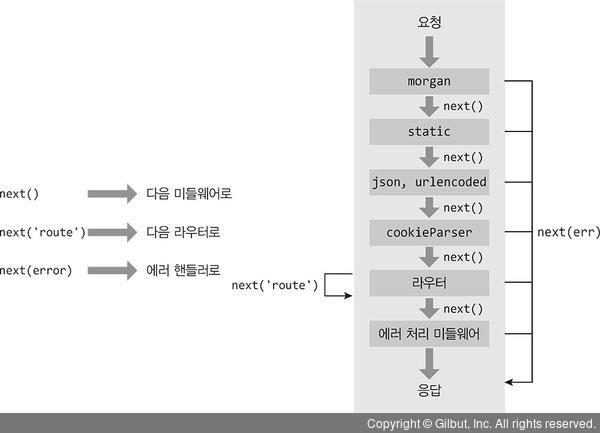
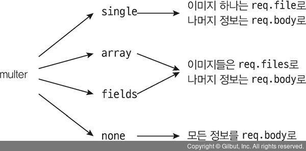

# 6 익스프레스 웹 서버 만들기

## 6.1 익스프레스 프로젝트 시작하기

express 프로젝트를 시작하기위해 learn-express 폴더를 만들고 npm init을 해주자

- package.json에 script start 을 추가해주자

```json
"scripts":  {
	"test":  "echo \"Error: no test specified\" && exit 1",
	"start":  "nodemon app"
},
```

- nodemon app은 app.js를 nodemon으로 실행한다는 뜻이다.
- nodemon 모듈은 코드 수정 사항이 생길때마다 서버를 자동으로 재시작한다.
  이후 express와 nodemon을 설치하자

```
npm i express
npm i -D nodemon
```

이후 서버의 역할을 할 app.js를 작성하자

```javascript
const express = require("express");

const app = express();
app.set("port", process.env.PORT || 3000);
app.get("/", (req, res) => {
  res.send("Hello Express");
});
app.listen(app.get("port"), () => {
  console.log(app.get("port"), "번 포트에서 대기중");
});
```

- **app.set('port', 포트)** : 서버가 실행될 포트를 지정한다. process.env 객체에 PORT 속성이 있다면 그값을 사용하고 없으면 3000번 포트를 지정하는데 `app.set(키,값)` 을 사용해서 데이터를 저장할 수 있다. 나중에 데이터를 `app.get(키)`로 가져올 수 있다.
- **app.get(주소, 라우터)** 는 주소에 대한 GET 요청이 올 때 어떤 동작을 하는지 적는 부분이다. 현재 GET / 요청시 응답으로 Hello Express 를 전송한다 익스프레스에서는 res.write, res.end 대신 `res.send`를 사용한다
- GET 요청 외에도 POST,PUT,PATCH, DELETE, OPTIONS에 대한 라우터를 위한 app.post app.put app.patch, app.delete, app.options 등의 메서드가 존재한다
- listen을 하는 부분은 http 웹 서버와 동일하다

단순 문자열 대신 HTML 로 응답하고 싶다면 `res.sendFile` 메서드를 사용하면 된다 단 파일의 경로를 path 모듈로 지정해줘야 한다.

```javascript
const express = require("express");
const path = require("path");

const app = express();
app.set("port", process.env.PORT || 3000);
app.get("/", (req, res) => {
  //res.send('Hello Express');
  res.sendFile(path.join(__dirname, "/index.html"));
});
app.listen(app.get("port"), () => {
  console.log(app.get("port"), "번 포트에서 대기중");
});
```

## 6.2 자주 사용하는 미들웨어

- 요청과 응답의 중간에 위치하여 미들웨어라고 부른다. 미들웨어는 요청과 응답을 조작하여 기능을 추가하기도 하고 나쁜 요청을 걸러내기도 한다.
- 미들웨어는 app.use와 함께 사용된다. `app.use( 미들웨어 )` 꼴이다.
  app.js

```javascript
app.set('port', process.env.PORT || 3000);

app.use((req, res, next) => {
  console.log('모든 요청에 다 실행됩니다.');
  next();
});
app.get('/', (req, res, next) => {
  console.log('GET / 요청에서만 실행됩니다.');
  next();
}, (req, res) => {
  throw new Error('에러는 에러 처리 미들웨어로 갑니다.')
});

app.use((err, req, res, next) => {
  console.error(err);
  res.status(500).send(err.message);
});

app.listen(app.get('port'), () => {
...
```

- app.use에 매개변수가 req,res,next 인 함수를 넣으면 된다. 미들웨어는 위에서부터 아래로 순서대로 실행되면서 요청과 응답 사이에 특별한 기능을 추가할 수 있다. <br />
- next라는 매개변수는 다음 미들웨어로 넘어가는 함수이다. next를 실행하지 않으면 다음 미들웨어가 실행되지 않는다.
- 주소를 첫 번째 인자로 넣어주지 않으면 미들웨어는 모든 요청에서 실행되고, 주소를 넣는다면 해당하는 요청에서만 실행된다.
- 현재 app.get('/') 의 두 번째 미들웨어에서 에러가 발생하고, 이 에러는 그 아래에 있는 에러처리 미들웨어에 전달된다.
- 에러처리 미들웨어는 매개변수가 err, req,res,next로 네 개인데 모든 매개변수를 사용하지 않더라고 반드시 네 개여야한다. res.state 메서드로 HTTP 상태 코드를 지정할 수 있다.

다음은 실무에서 자주 사용하는 패키지를 설치하자

```
npm i morgan cookie-parser express-session dotenv
```

이후 app.js 를 수정

```javascript
const express = require("express");
const morgan = require("morgan");
const cookieParser = require("cookie-parser");
const session = require("express-session");
const dotenv = require("dotenv");
const path = require("path");

dotenv.config();
const app = express();
app.set("port", process.env.PORT || 3000);

app.use(morgan("dev"));
app.use("/", express.static(path.join(__dirname, "public")));
app.use(express.json());
app.use(express.urlencoded({ extended: false }));
app.use(cookieParser(process.env.COOKIE_SECRET));
app.use(
  session({
    resave: false,
    saveUninitialized: false,
    secret: process.env.COOKIE_SECRET,
    cookie: {
      httpOnly: true,
      secure: false,
    },
    name: "session-cookie",
  })
);
app.use((req, res, next) => {
  console.log("모든 요청에 다 실행됩니다.");
  next();
});
```

.env

```env
COOKIE_SECRET=cookiesecret
```

- req,res,next가 안보이지만 미들웨어 내부에 존재한다. next도 내부적으로 호출하기 때문에 다음 미들웨어로 넘어갈 수 있다.
- dotenv 패키지는 .env 파일을 읽어서 process.env로 만든다. dotenv 패키지의 이름이 dot+env인 이유이다. process.env.COOKIE_SECRET에 cookiesecret 값이 할당된다.
- process.env를 별도의 파일로 관리하는 이유는 보안과 설정의 편의성 때문이다. 비밀 키들을 소스 코드에 그대로 적어두면 소스 코드가 유출되었을 때 키도 같이 유출된다. 따라서 .env 같은 별도 파일에 비밀 키를 적어두고 dotenv 패키지로 비밀키를 로딩하는 방식으로 관리한다.

---

### 6.2.1 morgan

위의 코드를 실행하면 기존 코드 외에 추가적인 로그가 적힌다.

```
...
GET / 500 7.382 ms - 1575
```

요청과 응답에 대한 정보를 콘솔에 기록하는데 morgan 미들웨어는

```javascript
app.use(morgan("dev"));
```

로 사용한다

- dev 외에 combined, common, short, tiny 등을 넣을 수 있고 이 값을 바꾸면 로그가 달라진다. 책에서 개발 환경에서는 dev, 배포 환경에서는 combined를 애용한다고 한다
- dev 모드 기준으로 GET / 500 7.382 ms - 1575 은 [HTTP메서드][주소][HTTP상태 코드][응답속도]-[응답 바이트] 를 의미한다.

---

### 6.2.2 static

static 미들웨어는 정적인 파일들을 제공하는 라우터 역할을 한다. 기본적으로 제공되기에 따로 설치할 필요 없이 express 객체 안에서 꺼내 쓰면 된다.

```javascript
app.use('요청경로', express.static('실제경로'));
app.use('/', express.static(__dirname, 'public')));
```

함수의 인자로 정적 파일들이 담겨져 있는 폴더를 지정하면 된다. 현재 public 폴더가 지정되어 있는데 예를 들어 public/stylesheets/style.css 는 http://localhost300/stylesheet/style.css 로 접근할 수 있다. public 폴더를 만들고 정적 파일들을 넣으면 브라우저에서 접근할 수 있다.

- 실제 서버 경로에는 public이 있지만 요청 주소에는 없는데 폴더 경로와 요청 경로가 다르므로 이는 보안에 큰 도움이 된다.
- 정적 파일들을 알아서 제공해줌으로 4.3에서 fs.readFile로 파일을 읽어서 전송할 필요가 없다. 만약 요청 경로에 해당하는 파일이 없으면 알아서 내부적으로 next를 호출한다. 만약 파일을 발견했다면 다음 미들웨어는 실행되지 않는다. 응답으로 파일을 보내고 next를 호출하지 않는다.

---

### 6.2.3 body-parser

요청의 본문에 있는 데이터를 해석해서 req.body 객체로 만들어주는 미들웨어이다. 보통 폼 데이터나 Ajax 요청의 데이터를 처리한다.  
body-parser 미들웨어는 다음과 같이 사용한다

```javascript
app.use(express.join());
app.use(express.urlencoded({extended:false});
```

express 4.16 버전부터 body-parser 미들웨어의 일부 기능이 익스프레스에 내장되었기에 따로 설치할 필요는 없으나 JSON이나 URL-encoede 형식 외에도 Raw, Text 형식의 데이터를 추가로 해석할 수도 있다.

- Raw는 요청의 본문이 버퍼 데이터일때, Text는 텍스트 데이터일때 해석하는 미들웨어이다. 버퍼나 텍스트 요청을 처리할 필요가 있다면 body-parser를 설치한 후 다음과 같이 추가한다

```
npm i body-parser
```

```javascript
const bodyParser = require("body-parser");
app.use(bodyParser.raw());
app.use(bodyParser.text());
```

요청 데이터 종류

- JSON , JSON 전달 방식
- URL-encoded 주소 형식으로 데이터 보냄.(폼 전송 방식) , urlencoded 메서드를 보면 `{extended:false}` 라는옵션이 들어 있는데 이 옵션이 false 면 노드의 querystring 모듈을 사용하여 쿠쿼리스트링을 해석하고 true면 qs 모듈을 사용하여 쿼리스트링을 해석한다.
- 4.2 절에서 본문을 전달받으려면 스트림을 사용했었는데 body-parser 패지키가 내부적으로 스트림을 처리해 req.body에 추가한다.
- 예를들어 URL-encoded 형식으로 name=zerocho&book=nodejs로 보내면req.body에 {name: 'zerocho', book : 'nodejs'} 가 들어간다

---

### 6.2.4 cookie-parser

cookie-parser는 요청에 동봉된 **쿠키를 해석해 req.cookies 객체로 만든다.** 4.3절의 `parseCookies`함수와 기능이 비슷하다.

```javascript
app.use(cookieParser(비밀키));
```

- 해석된 쿠키들은 req.cookies 객체에 들어간다. 유효 기간이 지난 쿠키는 알아서 걸러낸다.
- 첫 번째 인자로 비밀 키를 넣어줄 수 있다. 서명(암호화)된 쿠키가 있는 경우 제공한 비밀 키를 통해 해당 쿠키가 내 서버가 만든 쿠키임을 검증할 수 있다. 쿠키는 위조하기가 쉬우므로 비밀 키를 통해 만들어낸 서명을 쿠키 값 뒤에 붙인다. 서명된 쿠키는 req.cookies 대신 `req.signedCookies` 객체에 들어 있다.
- 쿠키를 생성/제거하기 위해서는 res.cookies, res.clearCookie 메서드를 사용해야 한다. `res.cookies(키, 값, 옵션)` 형식으로 사용한다.

```javascript
res.cookies("name", "zerocho", {
  expries: new Data(Data.now() + 900000),
  httpOnly: true,
  secure: true,
});
res.clearCookie("name", "zerocho", { httpOnly: true, secur: true });
```

- 쿠키를 지우려면 키, 값 외에도 옵션도 저확히 일치해야 쿠키가 지워지는데 expires 나 maxAge 옵션은 일치할 필요가 없다.
- 옵션 중에서 signed 옵션이 있는데 이를 true로 설정하면 쿠키 뒤에 서명이 붙는다. 내 서버가 쿠키를 만들었다는 것을 검증할 수 있으므로 대부분의 경우 서명 옵션을 켜두는 것이 좋다.

---

### 6.2.5 express-session

세션 관리용 미들웨어이다. 로그인 등의 이유로 세션을 구현하거나 특정 사용자를 위한 데이터를 임시적으로 저장해 둘 때 유요아다. 세션은 사용자 별로 req.session 객체 안에 유지된다.

```javascript
app.use(
  session({
    resave: false,
    saveUninitialized: false,
    secret: process.env.COOKIE_SECRET,
    cookie: {
      httpOnly: true,
      secure: false,
    },
    name: "session-cookie",
  })
);
```

- express-session 1.5 버전 이전에는 내부적으로 cookie-parser를 사용해서 cookie-parser 미들웨어보다 뒤에 있어야 했지만 1.5 버전 이후부터는 사용하지 않게 되어 순서가 상관없어졌다. 하지만 어떤 버전인지 모른다면 **cookie-parer 미들웨어 뒤에 놓는것**이 좋다.
- express-session은 인자로 세션에 대한 설정을 받는다. **resave**는 요청이 올때 세션에 수정사항이 생기지 않더라도 세션을 다시 저장할지 설정이고 **saveUninitialized**는 세션에 저장할 내역이 없더라도 처음부터 세션을 생성할지 설정하는 것이다.
- express-session은 세션 관리 시 클라이언트에 쿠키를 보낸다(**세션쿠키**) 안전하게 쿠키를 전송하려면 서명을 추가해야 하는데 secret 값이 이것이다. cookie-parser의 값과 같게 설정하는것이 좋다. 이름은 name 옵션으로 설정한다.
- secure는 현재 false로 해서 https 외의 환경도 사용할 수 있게 됐으나 실제 배포시에는 https를 사용하고 true로 설정하는것이 좋다.
- **store**라는 옵션도 있는데 현재는 메모리에 세션이 저장되나 서버를 재시작하면 메모리가 초기화되어 세션이 모두 사라진다. 따라서 배포시에는 store에 DB를 연결하여 세션을 유지하는것이 좋으며 레디스가 자주 쓰인다.

```javascript
req.session.name = "zerocho"; //세션 등록
req.sessionID; // 세션 아이디 확인
req.session.destory(); // 세션 모두 제거
```

세션을 모두 삭제하려면 req.session.destory()메서드를 호출하면 된다.

---

### 6.2.6 미들웨어의 특성 활용하기

```javascript
app.use(
  morgan("dev"),
  express.static("/", path.join(__dirname, "public")),
  express.json(),
  express.urlencoded({ extended: false }),
  cookieParser(process.env.COOKIE_SECRET)
);
```

- 위의 코드 처럼 여러 개의 미들웨어를 장착할 수 있으며 다음 미들웨어로 넘어가려면 next 함수를 호출해야 한다.(위의 미들웨어는 내부적으로 next를 호출함)
- next를 호출하지 않는 미들웨어는 res.send 나 res.sendFile 등의 메서드로 응답을 보내야 하며 express.static 같은 미들웨어는 정적 파일을 제공할 때 next 대신 res.sendFile 메서드로 응답을 보낸다.
- 따라서 정적 파일을 제공하는 경우 express.json, express.urlencoded, cookieParer 미들웨어는 실행되지 않는다.
- 만약 next도 호출하지 않고 응답도 보내지 않으면 클라이언트는 응답을 받지 못해 하염없이 기다리게 된다

</img>

- next 함수에 인자를 넣을 수 있다. 그러면 특수한 동작을 하는데 route 라는 문자열을 넣으면 다음 라우터의 미들웨어로 바로 이동하고 그 외의 인자를 넣는다면 에러 처리 미들웨어로 이동한다. 이때의 인자는 에러 처리 미들웨어의 err 매개변수가 된다.
- 라우터에서 에러가 발생할 때 next(err) 을 통해 에러처리 미들웨어로 넘긴다
- 미들웨어간의 데이터를 전달하려면 세션을 이용해 req.session 객체에 데이터를 넣어도 되지만 세션이 유지되는 동안 데이터도 유지되는 단점이 있다. 요청이 끝날때까지만 데이터를 유지하고 싶다면 req 객체에 데이터를 넣어두면 된다.

```javascript
app.use((req,res,next)=>{
	req.data = ' 데이터 '
	next()
}, (req,res,next)=>{
	console.log(req.data); 데이터 받기
	next()
});
```

새로운 요청이 오면 req.data는 초기화된다. 속성명이 꼭 data일 필요는 없지만 다른 미들웨어와 겹치지 않게 조심해야 한다.

> - app.set 과 차이
>   app.set으로 익스프레스에서 데이터를 저장하고 app.get으로 데이터를 가져올 수 있지만 req 객체에 데이터를 넣는 이유가 있는데 app.set는 익스프레스에서 전역적으로 사용되므로 사용자 개개인의 값을 넣는것보다 앱 전체의 설정을 공유할때 사용하면 된다

미들웨어 사용 시 유용한 패턴

```javascript
app.use(morgan("dev"));
//또는
app.use((req, res, next) => {
  morgan("dev")(req, res, next);
});
```

위 패턴이 유용한 이유는 아래 처럼 확장할 수 있다.

```javascript
app.use((req, res, next) => {
  if (process.env.NODE_ENV === "production") {
    morgan("combined")(req, res, next);
  } else {
    morgan("dev")(req, res, next);
  }
});
```

### 6.2.7 multer

이미지 동영상 등 여러가지 파일들을 멀티파트 형식으로 업로드 할 때 사용하는 미들웨어이다. 멀티파트 형식이란 아래와 같이 enctype 이 multipart/form-data 인 폼을 통해 업로드하는 데이터 형식을 의미한다.
multipart.html

```html
<form action="/upload" method="post" enctype="multipart/form-data">
  <input type="file" name="image" />
  <input type="text" name="title" />
  <button type="submit">업로드</button>
</form>
```

이러한 폼을 통해 업로드 하는 파일은 body-parser 로는 처리할 수 없고 직접 파싱 하기도 어려우니 multer 라는 미들웨어를 따로 사용하면 편하다.

```
npm i multer
```

multer 의 기본적인 설정을 알아보자

```javascript
const multer = require("multer");

const upload = multer({
  storage: multer.diskStorage({
    destination(req, file, done) {
      done(null, "uploads/");
    },
    filename(req, file, done) {
      const ext = path.extname(file.originalname);
      done(null, path.basename(file.originalname, ext) + Date.now() + ext);
    },
  }),
  limits: { fileSize: 5 * 1024 * 1024 },
});
```

- multer 함수의 인자로 설정을 넣는다. storage 속성에는 어디에(destination) 어떤 이름(filename) 으로 저장할 지 넣는다.
- destination, filename 함수의 req 매개변수에는 요청에 대한 정보가, file 객체에는 업로그한 파일에 대한 정보가 있다
- done 매개변수는 함수인데 첫 번째 인자에는 에러가 있으면 에러를 넣고 두번째 인자에는 실제 경로나 파일 이름을 넣어준다. req나 file의 데이터를 가공해서 done으로 넘기는 형식이다.
- 현재 설정으로는 uploads 라는 폴더에 파일명 + 현재시간.확장자 파일명으로 업로드 하고 있다. 현재 시간을 넣어주는 이유는 파일명이 겹치지 않게 하기 위해서이다
- limits 속성에는 업로드에 대한 제한 사항을 설정할 수 있다. 위에서는 파일사이즈(바이트 단위)를 5MB로 제한함
- 위 설정을 활용하려면 uploads 폴더가 존재해야 하는데 없다면 직접 만들거나 fs 모듈을 사용해 서버를 시작할때 생성한다.

```javascript
const fs = require('fs');
try{
	fs.readFileSync('uplodas');
} catch(err){
	console.error('uploads 폴더가 없어서 폴더를 생성합니다'):
	fs.mkdirSync('uploads');
}
```

설정이 끝나면 upload 변수가 생기는데 여기에 다양한 종류의 미들웨어가 있다.

- 파일을 하나만 업로드 하는 경우 single 미들웨어를 사용한다.

```javascript
app.post("/upload", upload.single("imgae"), (req, res) => {
  console.log(req.file, req.body);
  res.send("ok");
});
```

single 미들웨어를 라우터 미들웨어 앞에 넣어두면, multer 설정에 따라 파일 업로두 후 req.file 객체가 생성된다. 인자는 input 태그의 name 이나 폼 데이터의 키와 일치하게 넣으면 된다.

- 업로드 성공 시 결과는 req.file 객체 안에 들어있다. req.body 에는 파일이 아닌 데이터인 title 이 들어 있다.
- req.file

```json
{
  "filename": "img",
  "originalname": "nodejs.png",
  "encoding": "7bit",
  "mimetype": "image/png",
  "destination": "uploads/",
  "filename": "nodejs1514197844339.png",
  "size": 53357
}
```

여러 파일을 업로드 하는 경우 HTML의 input 태그에는 multiple 을 쓰면 된다.

```html
<form id="form" action="/upload" method="post" enctype="multipart/form-data">
  <input type="file" name="many" multiple />
  <input type="text" name="title" />
  <button type="submit">업로드</button>
</form>
```

- 미들웨어는 single 대신 array 로 교체한다

```javascript
app.post("/upload", upload.array("many"), (req, res) => {
  console.log(req.files, req.body);
  res.send("ok");
});
```

업로드 결과도 req.file 대신 req.files 배열에 들어 간다.
파일을 여러개 업로드하지만 input 태그나 폼 데이터의 키가 다른 경우 fields 미들웨어를 사용한다

```html
<form id="form" action="/upload" method="post" enctype="multipart/form-data">
  <input type="file" name="image1" />
  <input type="file" name="image2" />
  <input type="text" name="title" />
  <button type="submit">업로드</button>
</form>
```

- 미들웨어는 fields 를 사용하고 인자로 input 태그의 name를 각각 적는다

```javascript
app.post(
  "/upload",
  upload.fields([{ name: "image1" }, { name: "image2" }]),
  (req, res) => {
    console.log(req.files, req.body);
    res.send("ok");
  }
);
```

업로드 결과도 req.files.image1, req.files.image2에 각각 들어 있다.

- 특수한 경우지만 파일을 업로드 하지 않고 멀티파트 형식으로 업로드 하는 경우가 있다.
- 그럴 때는 none 미들웨어를 사용한다.

```html
<form id="form" action="/upload" method="post" enctype="multipart/form-data">
  <input type="text" name="title" />
  <button type="submit">업로드</button>
</form>
```

```javascript
app.post("/upload", upload.none(), (req, res) => {
  console.log(req.body);
  res.send("ok");
});
```

파일을 업로드 하지 않았으므로 req.body만 존재한다.
</img>
실습 예제

```javascript
...

try {
  fs.readdirSync('uploads');
} catch (error) {
  console.error('uploads 폴더가 없어 uploads 폴더를 생성합니다.');
  fs.mkdirSync('uploads');
}
const upload = multer({
  storage: multer.diskStorage({
    destination(req, file, done) {
      done(null, 'uploads/');
    },
    filename(req, file, done) {
      const ext = path.extname(file.originalname);
      done(null, path.basename(file.originalname, ext) + Date.now() + ext);
    },
  }),
  limits: { fileSize: 5 * 1024 * 1024 },
});
app.get('/upload', (req, res) => {
  res.sendFile(path.join(__dirname, 'multipart.html'));
});
app.post('/upload',
  upload.fields([{ name: 'image1' }, { name: 'image2' }]),
  (req, res) => {
    console.log(req.files, req.body);
    res.send('ok');
  },
);
```

## 6.3 Router 객체로 라우팅 분리하기

app.js에서 app.get 같은 메서드가 라우터 부분이다. 라우터를 연결하면 app.js 코드가 매우 길어지므로 익스프레스에서는 라우터를 분리할 수 있는 방법을 제공한다.
routes 폴더를 만들고 그 안에 index.js와 user.js를 작성한다.

- routes/index.js

```javascript
const express = require("express");
const router = express.Router();

//GET / 라우터
router.get("/", (req, res) => {
  res.send("Hello Express");
});
module.exports = router;
```

- routes/user.js

```javascript
const express = require("express");

const router = express.Router();
// GET /user 라우터
router.get("/", (req, res) => {
  res.send("Hello User");
});
module.exports = router;
```

만든 index와 user를 app.use를 통해 app.js 에 연결한다. 그리고 에러 처리 미들웨어 위에 404 상태 코드를 응답하는 미들웨어를 하나 추가한다

```javascript
const path = require('path');

dotenv.config();
const indexRouter = require('./routes');
const userRouter = require('./routes/user');
...
  name: 'session-cookie',
}));

app.use('/', indexRouter);
app.use('/user', userRouter);

app.use((req, res, next) => {
  res.status(404).send('Not Found');
});

app.use((err, req, res, next) => {
...
```

- indexRouter 를 ./routes로 require 할 수 있는 이유는 index.js는 생략 할 수 있기 때문이다.
  require('./routes/index.js')와 require('./routes')는 같다.
- userRouter에 /user 와 user.js의 get / 이 합쳐서 get /user 라우터가 되었다. 이렇게 app.use로 연결할 때 주소가 합쳐진다.
- 라우터 주소에는 정규표현식을 비롯한 특수 패턴을 사용할 수 있다. 여러 가지 패턴이 있지만 자주 쓰이는 패턴인 라우트 매개변수 패턴을 알아보자

```javascript
router.get("/user/:id", function (req, res) {
  console.log(req.params, req.query);
});
```

- id 부분에 다른 값이 들어올 수 있다. /user/1 이나 /user:/123 등의 요청도 이 라우터가 처리한다. 이 방식의 장점은 :id 에 해당하는 1이나 123을 조회할 수 있다는 점이며, req.params 객체 안에 들어 있다. :id면 req.params.id로, :type 면 req.params.type 으로 조회할 수 있다.
- 이 패턴을 사용할때 주의할 점은 일반 라우터보다 뒤에 위치해야 한다. 다양한 라우터를 아우르는 와일드카드 역할을 하므로 일반 라우터보다는 뒤에 위치해야 다른 라우터를 방해하지 않는다.

```javascript
router.get('/user/:id', (req,res)=>{
	console.log('얘만 실행됩니다');
}
router.get('/user/like', (req,res)=>{
	console.log('전혀 실행되지 않는다');
}
```

- 주소에 쿼리 스트링을 쓸 때도 있다. 쿼리스트링의 키-값 정보는 req.query 객체 안에 들어 있다.
- 예를들어 /users/123?limit=5&skip=10 이라는 주소의 요청이 들어왔을 때 req.params와 req.qeury 객체는 각각 {id:123} { limit:'5', skit:'10'} 이다.
- 라우터에서 자주 쓰이는 활용법으로는 app.route나 router.route가 있다.

```javascript
router.get("/abc", (req, res) => {
  res.send("GET /abc");
});
router.post("/abc", (req, res) => {
  res.send("POST /abc");
});
```

다음과 같은 코드를

```javascript
router
  .route("/abc")
  .get((req, res) => {
    res.send("GET /abc");
  })
  .post((req, res) => {
    res.send("POST /abc");
  });
```

이렇게 바꿀 수 있다.

## 6.4 req, res 객체 살펴보기

익스프레스의 req, res 객체는 http 모듈의 req, res 객체를 확장한 것이다. 기존 http 모듈의 메서드도 사용할 수 있고 익스프레스가 추가한 메서드나 속성을 사용할 수 있다.

- 예를들어 res.writeHead, res.write, res.end 메서드를 그대로 사용할 수 있고 res.send나 res.sendFile 같은 메서드도 쓸 수 있다.
- **req.app** 객체를 통해 app객체에 접근할 수있다. `req.qpp.get('port')` 같은 식으로 사용 가능
- **req.body** body-parser 미들웨어가 만드는 요청의 본문을 해석한 객체이다
- **req.cookies** cookie-parser 미들웨어가 만드는 요청의 쿠키를 해석한 객체이다
- **req.ip** 요청의 ip주소가 담겨져 있다
- **req.params** 라우트 매개변수에 대한 정보가 담긴 객체이다
- **req.query** 쿼리스트링에 대한 정보가 담긴 객체이다
- **req.signedCookies** 서명된 쿠키들은 req.query 대신 여기에 담겨 있다.
- **req.get(헤더 이름)**: 헤더의 값을 가져오고 싶을때 사용하는 메서드이다.

<br/>

res 객체

- **res.app** req.app 처럼 res 객체를 통해 app 객체에 접근할 수 있다.
- **res.cookie(키,값, 옵션)** 쿠키를 설정하는 메서드이다.
- **res.clearCookie(키, 값, 옵션)** 쿠키를 제거하는 메서드이다.
- **res.end()** 데이터 없이 응답을 보낸다
- **res.json(JSON)** json 형식의 응답을 보낸다
- **res.redirect(뷰,데이터)** 리다이렉트할 주소와 함께 응답을 보낸다.
- **res.render(뷰, 데이터)** 다음 절에서 다룰 템플릿 엔진을 렌더링해서 응답할 때 사용하는 메서드
- **res.send(데이터)** 데이터와 함께 응답을 보낸다. 데이터는 문자열일 수도 있고 HTML 일수도 있으며, 버퍼일 수도 있고 객체나 배열일 수도 있다.
- **res.sendFile(경로)** 경로에 위치한 파일을 응답한다.
- **res.set(헤더, 값)** 응답의 헤더를 설정한다.
- **res.status(코드)** 응답 시의 HTTP 상태 코드를 지정한다.

req나 res 객체의 메서드는 다음과 같이 메서드 체이닝을 사용할 수 있다. 메서드 체이닝을 활용하면 코드 양을 줄일 수 있다.

```javascript
res.status(201).cookie("test", "test").redirect("/admin");
```
